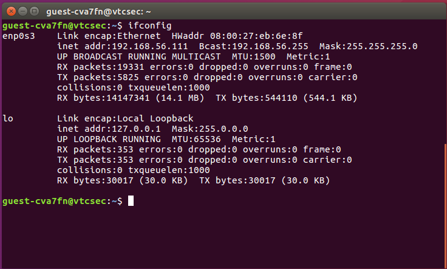

# Challenge Description

## About Release

**Name:** Basic Pentesting: 1

**Date release:** 8 Dec 2017

**Author:** Josiah Pierce

**Series:** Basic Pentesting

---

## Download

> Please remember that VulnHub is a free community resource so we are unable to check the machines that are provided to us. Before you download, please read our FAQs sections dealing with the dangers of running unknown VMs and our suggestions for “protecting yourself and your network”. If you understand the risks, please download!

* **Filename:** `basic_pentesting_1.ova` (Size: 2.6 GB)
* **Download (Google Drive):** `https://drive.google.com/file/d/1wkfI9cpyjouj6ox_88EqF6tKMtTHIYC1/view?usp=sharing`
* **Download (Mirror):** `https://download.vulnhub.com/basicpentesting/basic_pentesting_1.ova`

---

## Description

This is a small boot2root VM created for a university cyber security group. It contains multiple remote vulnerabilities and multiple privilege escalation vectors. The author tested the VM on VirtualBox (recommended). It has also been reported to work on VMware, but that was not personally tested by the author.

This VM is specifically intended for newcomers to penetration testing — difficulty is aimed at beginners.

**Goal:** Remotely attack the VM and gain root privileges. After completing the main path, try to discover other vectors that may have been missed.

If you enjoyed the VM or have questions, contact the author: **[josiah@vt.edu](mailto:josiah@vt.edu)**

If you finish the VM, please consider posting a writeup to help others.

---

## File Information

* **Filename:** `basic_pentesting_1.ova`
* **File size:** 2.6 GB
* **MD5:** `D1FB9419D73D26AB0C88D8DDB7C10A02`
* **SHA1:** `F207A5CED5369A4BA29971B932B8C683C4AA14C2`

---

## Virtual Machine

* **Format:** Virtual Machine (VirtualBox - OVA)
* **Operating System:** Linux
* **Recommended platform:** VirtualBox (tested). VMware may work but is unverified.

---

## Networking

* **DHCP service:** Enabled
* **IP address:** Automatically assigned (via DHCP)

---

## Safety & Run Notes

* Run unknown VM images in an isolated environment (host-only or on an isolated network) to avoid exposing your host/network.
* Snapshot or backup your host before importing the OVA.
* Prefer VirtualBox if you want behavior closest to the author's testing.
* Disable bridge networking unless you understand the risks and have permission to use the network segment.

---

## Author Contact & Writeups

* **Author:** Josiah Pierce — `josiah@vt.edu`
* If you produce a writeup, include commands, screenshots, and a short narrative explaining each step so others can follow.

---

## License / Attribution

This content is derived from the original VulnHub listing for *Basic Pentesting: 1*. Keep any redistribution or public writeups respectful of the author's original work and VulnHub's terms.

---

*End of document — edit or expand the walkthrough sections above with your notes and findings.*

---

# Basic Pentesting 1 Walktrough

### First Step

paling pertama tentu saja kita scanning IP dari target, mari kita gunakan tools `arp-scan`

```bash
arp-scan -l
```

kemudian outputnya akan begini

```bash
Interface: eth0, type: EN10MB, MAC: 08:00:27:d4:54:92, IPv4: 192.168.56.105
WARNING: Cannot open MAC/Vendor file ieee-oui.txt: Permission denied
WARNING: Cannot open MAC/Vendor file mac-vendor.txt: Permission denied
Starting arp-scan 1.10.0 with 256 hosts (https://github.com/royhills/arp-scan)
192.168.56.1    0a:00:27:00:00:09       (Unknown: locally administered)
192.168.56.100  08:00:27:c1:54:ee       (Unknown)
192.168.56.110  08:00:27:d8:0b:51       (Unknown)
192.168.56.111  08:00:27:eb:6e:8f       (Unknown)

4 packets received by filter, 0 packets dropped by kernel
Ending arp-scan 1.10.0: 256 hosts scanned in 1.971 seconds (129.88 hosts/sec). 4 responded
```

ya, IP yang digunakan target adalah `192.168.56.111` karena aku tau dari guest session si VM.



---

### Second Step

Sekarang adalah waktunya untuk 


